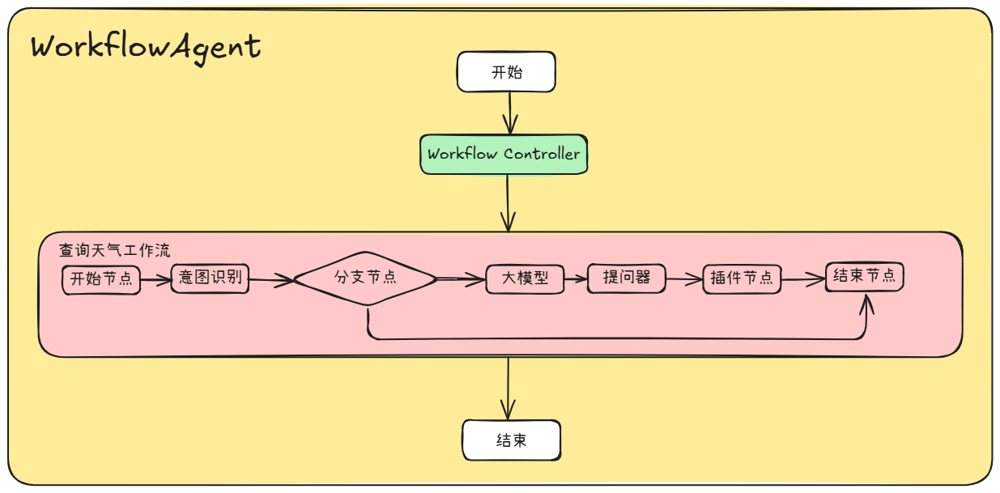

# 使用Open Jiuwen构建一个天气查询Workflow Agent

> 运行环境：Python ≥ 3.11，仅需 `pip install jiuwen`。

---

## 1. 背景：Workflow Agent

| 概念                 | 定义                    | 适用场景                 |
|--------------------|-----------------------|----------------------|
| **Workflow Agent** | LLM 与工具按**预定义代码路径**编排 | 任务可拆成固定步骤，追求稳定 & 低延迟 |
| **ReAct Agent**    | LLM **动态决定**下一步骤与工具   | 步骤数量不可预期，需长期自主决策     |

本教程实现一个可直接运行Workflow的 **Workflow Agent**：  
用户输入 → 意图识别 → query改写 → 参数提取 → 调用天气 API → 返回结果

```angular2html
用户说：查询上海的天气
├─▶ ① IntentDetection  →  判定意图 = 天气查询
├─▶ ② LLM query改写     →  查询上海的天气 2025-07-26
├─▶ ③ Questioner       →  参数提取 {"location": "shanghai", "date": "2025-07-26"}
├─▶ ④ Tool 调 API       →  {"result":"{'city': 'Shanghai', 'country': 'CN', 'feels_like': 36.21, 'humidity': 86, 'temperature': 29.21, 'weather': '多云', 'wind_speed': 5.81}"}
└─▶ ⑤ WorkflowAgent    →  输出天气查询的执行结果
```


---

## 2. 安装依赖

```bash

pip install jiuwen

```

---

## 3. 实现一个简单的天气查询API工具

```python
from jiuwen.core.utils.tool.service_api.restful_api import RestfulApi
from jiuwen.core.utils.tool.service_api.param import Param

weather_tool = RestfulApi(
    name="weather",
    description="查询天气",
    params=[
        Param(name="location", type="string", description="城市"),
        Param(name="date", type="int", description="日期"),
    ],
    path="http://127.0.0.1:8000/weather",
    method="GET",
)
```

## 4. 定义模型配置

```python
import os
from jiuwen.core.utils.llm.base import BaseModelInfo
from jiuwen.core.component.common.configs.model_config import ModelConfig

# 提供你的模型信息
API_BASE = os.getenv("API_BASE", "")
API_KEY = os.getenv("API_KEY", "")
MODEL_NAME = os.getenv("MODEL_NAME", "")
MODEL_PROVIDER = os.getenv("MODEL_PROVIDER", "")


def create_model_config() -> ModelConfig:
    return ModelConfig(
        model_provider=MODEL_PROVIDER,
        model_info=BaseModelInfo(
            model=MODEL_NAME,
            api_base=API_BASE,
            api_key=API_KEY,
            temperature=0.7,
            top_p=0.9,
            timeout=30,
        ),
    )

```

---

## 4. 构建四大节点组件

| 节点   | 职责                     | 实现类                        |
|------|------------------------|----------------------------|
| 意图识别 | 判断用户是否需要查天气            | `IntentDetectionComponent` |
| 大模型  | 用 LLM 抽取 location/date | `LLMComponent`             |
| 提问器  | 若字段缺失，主动提问             | `QuestionerComponent`      |
| 工具调用 | 真正调用天气 RESTful API     | `ToolComponent`            |

代码：

```python
from jiuwen.core.component.intent_detection_comp import (
    IntentDetectionComponent, IntentDetectionConfig)
from jiuwen.core.component.llm_comp import LLMComponent, LLMCompConfig
from jiuwen.core.component.questioner_comp import (
    QuestionerComponent, QuestionerConfig, FieldInfo)
from jiuwen.core.component.tool_comp import ToolComponent, ToolComponentConfig
from jiuwen.core.utils.prompt.template.template import Template


# ---------- 1. 意图识别 ----------
def _create_intent_detection_component() -> IntentDetectionComponent:
    """创建意图识别组件。"""
    model_config = create_model_config()
    user_prompt = """
    {{user_prompt}}

    当前可供选择的功能分类如下：
    {{category_info}}

    用户与助手的对话历史：
    {{chat_history}}

    当前输入：
    {{input}}

    请根据当前输入和对话历史分析并输出最适合的功能分类。输出格式为 JSON：
    {"class": "分类xx"}
    如果没有合适的分类，请输出 {{default_class}}。
    """
    config = IntentDetectionConfig(
                user_prompt="请判断用户意图",
                category_info="",
                category_list=["分类1", "分类2"],
                category_name_list=["默认意图", "查询某地天气"],
                default_class="分类1",
                model=model_config,
                intent_detection_template=Template(
                    name="default",
                    content=[{"role": "user", "content": user_prompt}],
                ),
                enable_input=True,
            )
    component = IntentDetectionComponent(config)
    component.add_branch("${intent.classificationId} == 0", ["end"], "默认分支")
    component.add_branch("${intent.classificationId} == 1", ["llm"], "查询天气分支")
    return component


# ---------- 2. 大模型组件 ----------
def _create_llm_component() -> LLMComponent:
    """创建 LLM 组件，仅用于抽取结构化字段（location/date）。"""
    model_config = create_model_config()
    current_date = build_current_date()
    user_prompt_prefix = "你是一个query改写的AI助手。今天的日期是{}。" 
    user_prompt = "\n原始query为：{{query}}\n\n帮我改写原始query，要求：\n1. 只把地名改为英文，其他信息保留中文；\n2. 默认日期为今天；\n3. 时间为YYYY-MM-DD格式。"
    config = LLMCompConfig(
        model=model_config,
        template_content=[{"role": "user", "content": user_prompt_prefix.format(current_date) + user_prompt}],
        response_format={"type": "text"},
        output_config={
            "query": {"type": "string", "description": "改写后的query", "required": True}
        },
    )
    return LLMComponent(config)


# ---------- 3. 提问器组件 ----------
def _create_questioner_component() -> QuestionerComponent:
    """创建提问器组件。"""
    key_fields = [
        FieldInfo(field_name="location", description="地点", required=True),
        FieldInfo(field_name="date", description="时间", required=True, default_value="today"),
    ]
    model_config = create_model_config()
    config = QuestionerConfig(
        model=model_config,
        question_content="",
        extract_fields_from_response=True,
        field_names=key_fields,
        with_chat_history=False,
        prompt_template=[
            {"role": "system", "content": _QUESTIONER_SYSTEM_TEMPLATE},
            {"role": "user", "content": _QUESTIONER_USER_TEMPLATE},
        ],
    )
    return QuestionerComponent(config)


# ---------- 4. 工具调用组件 ----------
def _create_plugin_component() -> ToolComponent:
    """创建插件组件，可调用外部 RESTful API。"""
    tool_config = ToolComponentConfig(needValidate=False)
    return ToolComponent(tool_config).set_tool(weather_tool)
```

---

## 5. 使用JiuWen引擎构建天气查询Workflow

```python
from jiuwen.core.context.context import Context


def build_workflow():
    # 2. 初始化工作流与上下文
    id = "test_weather_agent"
    version = "1.0"
    name = "weather"
    workflow_config = WorkflowConfig(
        metadata=WorkflowMetadata(name=name, id=id, version=version)
    )
    schema = WorkflowSchema(
        id="weather_wf_1",
        name="weather",
        version="0.1.0",
        description="天气查询工作流",
        inputs={"query": {"type": "string"}},
    )
    flow = Workflow(workflow_config=workflow_config, graph=PregelGraph())
    context = WorkflowContext(config=Config(), state=InMemoryState(), store=None)

    # 3. 实例化各组件
    start = _create_start_component()
    intent = _create_intent_detection_component()
    llm = _create_llm_component()
    questioner = _create_questioner_component()
    plugin = _create_plugin_component()
    end = _create_end_component()

    # 4. 注册组件到工作流
    flow.set_start_comp(
        "start",
        start,
        inputs_schema={"systemFields": {"query": "${query}"}},
    )
    flow.add_workflow_comp(
        "intent",
        intent,
        inputs_schema={"input": "${start.systemFields.query}"},
    )
    flow.add_workflow_comp(
        "llm",
        llm,
        inputs_schema={"userFields": {"query": "${start.systemFields.query}"}},
    )
    flow.add_workflow_comp(
        "questioner",
        questioner,
        inputs_schema={"query": "${llm.userFields.query}"}
    )
    flow.add_workflow_comp(
        "plugin",
        plugin,
        inputs_schema={
            "userFields": "${questioner.userFields.key_fields}",
            "validated": True,
        },
    )
    flow.set_end_comp("end", end, inputs_schema={"userFields": {"output": "${plugin.result}"}})

    # 5. 连接拓扑
    flow.add_connection("start", "intent")
    flow.add_connection("llm", "questioner")
    flow.add_connection("questioner", "plugin")
    flow.add_connection("plugin", "end")

    return context, flow
```

---

## 6. 构建WorkflowAgent

```python
from jiuwen.agent.workflow_agent import WorkflowAgent
from jiuwen.agent.config.workflow_config import WorkflowAgentConfig
from jiuwen.core.context.agent_context import AgentContext

_, workflow = _build_workflow()
agent_config = WorkflowAgentConfig(
    id="weather_agent",
    version="0.1.0",
    description="天气查询agent",
    workflows=[schema],
)

workflow_agent = WorkflowAgent(agent_config, agent_context=AgentContext())
workflow_agent.bind_workflows([workflow])
```

---

## 7. 运行天气查询Agent

可以直接运行目录下的代码示例：`tests/system_tests/agent/test_workflow_agent.py`

```python
import asyncio


async def test_weather_workflow():
    result = await workflow_agent.invoke({"query": "上海天气如何"})
    print(f"Workflow Agent输出的最终结果：{result}")


asyncio.run(test_weather_workflow())
```

恭喜你，成功搭建了第一个Workflow Agent！

---
